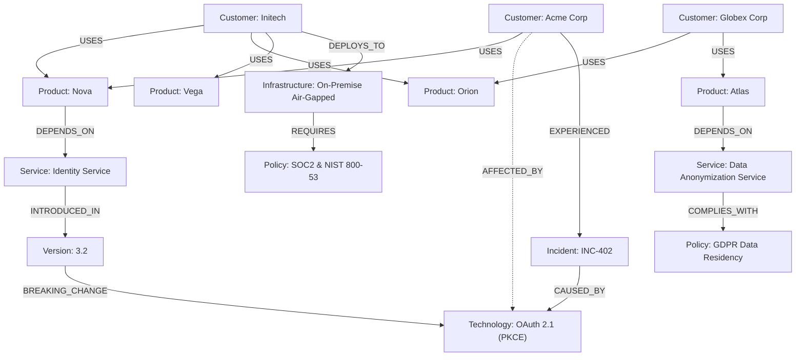

# Lesson 02: Enterprise Knowledge Base & Document Corpus

This document details the design, architecture, and verification of the synthetic enterprise document corpus created in **Lesson 2** for GraphRAGX.

---

## 1. Overview & Objectives

Traditional RAG evaluation datasets often rely on single-paragraph encyclopedic facts where all context required to answer a question resides within a single chunk (e.g. *"What is the capital of France?"*). In such scenarios, dense vector similarity search works adequately.

However, real-world enterprise queries are relational, multi-hop, and entity-centric:
- *"Which enterprise customers are impacted by the breaking authentication changes introduced in Version 3.2?"*
- *"What authorization engine regulates access when Product Atlas executes audit queries across Product Nova?"*
- *"Which European customer relies on automated tokenization to comply with GDPR data residency mandates?"*

To properly benchmark and prove the advantages of GraphRAG and Hybrid RAG over naive Vector RAG, Lesson 2 constructs a realistic, interconnected **20-document enterprise corpus** for a fictional cloud infrastructure company: **CloudScale Systems**.

---

## 2. Document Corpus Inventory

The 20 markdown documents reside in [`data/documents/`](../../data/documents/) and are categorized across 6 operational domains:

| Domain | Document File | Key Entities & Topics |
| :--- | :--- | :--- |
| **Executive & Overview** | `company_overview.md` | CloudScale Systems, Org Divisions, Core Tenets, Sarah Chen, Marcus Vance |
| **Product Portfolio** | `products.md` | Nova, Orion, Atlas, Vega product portfolio summary |
| | `product_nova.md` | Cloud Analytics, AWS EKS, Apache Arrow, Identity Service, Policy Engine |
| | `product_orion.md` | Event Broker, Apache Kafka, Gateway Service, Azure AKS, stream routing |
| | `product_atlas.md` | Governance Portal, SOC2 compliance, Data Anonymization Service, GDPR |
| | `product_vega.md` | Time-Series Engine, LSM-tree, Gorilla compression, telemetry indexing |
| **Security & Identity** | `authentication.md` | Identity Service, OAuth 2.0 vs OAuth 2.1, PKCE, PASETO v4, breaking changes |
| | `authorization.md` | Policy Engine, Authz Service, RBAC, ABAC, OPA / Rego compilation |
| | `api_platform.md` | Gateway Service, Envoy proxy, OpenAPI 3.1 validation, rate limiting |
| | `security.md` | SOC2 Type II, ISO 27001, AES-256-GCM, AWS KMS, Azure Key Vault |
| | `data_privacy.md` | GDPR, CCPA, Data Anonymization Service, Differential Privacy, RTBF |
| **Infrastructure** | `deployment.md` | AWS (EKS, Aurora, S3), Azure (AKS, Cosmos), On-Premise Kubernetes |
| **Commercial & Customers**| `billing.md` | Metered Usage, Billing Engine, QCU compute units, Stripe integration |
| | `pricing.md` | Starter, Growth, and Enterprise Tiers (SLA 99.99%, dedicated VPC) |
| | `enterprise_customers.md`| Directory of Tier-1 strategic customer accounts |
| | `customer_acme.md` | Acme Corp (Retail/Logistics), AWS Enterprise, Nova, INC-402 incident |
| | `customer_globex.md` | Globex Corp (Fintech), Azure Europe, Orion + Atlas, GDPR compliance |
| | `customer_initech.md` | Initech (Defense/Aerospace), On-Prem Air-Gapped, Nova + Orion + Vega |
| **Reliability & History** | `incident_response.md` | Incident INC-402 retrospective: v3.2 token invalidation on Acme Corp |
| | `version_history.md` | Platform release notes: v3.0 ("Genesis"), v3.1 ("Centauri"), v3.2 ("Polaris") |

---

## 3. Multi-Hop Graph Topology & Test Scenarios

The corpus is engineered with explicit relational paths designed to challenge retrieval engines:



### Why Naive Vector RAG Fails Here
Consider the prompt:
> *"Which enterprise customers are affected by the breaking authentication changes in Version 3.2?"*

- **Chunk Boundaries**: In a vector search, chunks matching "breaking authentication changes in Version 3.2" come from `authentication.md` and `version_history.md`. Neither chunk mentions "Acme Corp" in the context of its deployment or contract.
- **Missing Direct Similarity**: The chunk describing Acme Corp's contract in `customer_acme.md` has low lexical and cosine similarity to queries about OAuth 2.1 RFC specifications.
- **Graph Advantage**: A graph traversal easily hops:
  $$\text{Version 3.2} \xrightarrow{\text{AFFECTS}} \text{Product Nova} \xleftarrow{\text{USES}} \text{Acme Corp}$$
  and extracts the exact multi-hop reasoning path.

---

## 4. Document Metadata Schema

Every document includes structured YAML frontmatter:
```yaml
---
title: Product Nova Architecture and Specifications
document_id: product_nova
department: Engineering
access_tier: Internal
version: 3.2
last_updated: 2026-02-01
---
```
This metadata will be leveraged in **Lesson 3** for metadata-filtered semantic chunking and access control evaluations.

---

## 5. Verification & Testing

The document suite is validated via `tests/test_documents.py`:
- `test_all_expected_documents_exist`: Asserts all 20 documents are present and non-empty.
- `test_frontmatter_metadata_structure`: Verifies valid YAML frontmatter containing required keys (`title`, `document_id`, `department`, `access_tier`, `version`).
- `test_multi_hop_cross_references`: Verifies that key entity mentions occur across at least 3-5 distinct documents to ensure multi-hop path connectivity.

Execute verification:
```bash
./.venv/bin/pytest tests/test_documents.py -v
```
Output: 3 passed tests.
