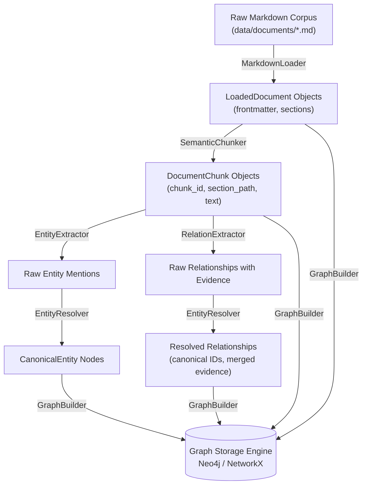

# Lesson 06: Graph Builder & Idempotent Ingestion Pipeline

This document details the design, architecture, and verification of the knowledge graph construction engine and end-to-end ingestion pipeline built in **Lesson 6** of GraphRAGX.

---

## 1. Overview & Objectives

Building an enterprise knowledge graph requires coordinating multiple ingestion phases into a deterministic, reproducible, and idempotent workflow:
1. **Dual-Layer Topology**:
   - **Document Structure Layer**: Links `(Chunk)-[:PART_OF]->(Document)` and `(Chunk)-[:MENTIONS]->(Entity)`.
   - **Semantic Knowledge Layer**: Directed domain relationships `(Entity)-[:RELATION]->(Entity)` grounded by `Evidence` referencing specific chunks.
2. **Strict Idempotency**: Re-running the pipeline over existing documents must never produce duplicate nodes, disconnected edges, or corrupted counts.
3. **Operational Observability**: Emits a structured `IngestionSummary` tracking throughput, entity yields, edge densities, and total wall-clock duration.
4. **Developer Tooling**: Standalone CLI scripts (`scripts/build_graph.py` and `scripts/ingest.py`) for automated operations and developer workflows.

---

## 2. Architecture & Pipeline Workflow



---

## 3. Implementation Details

### 3.1. GraphBuilder (`app/ingestion/graph_builder.py`)
- **Schema Initialization**: Ensures uniqueness constraints and indexes are established prior to insertion.
- **Document & Chunk Ingestion**: Ingests `Document` nodes, `Chunk` nodes, and creates structural `PART_OF` edges.
- **Mention Linking**: Analyzes chunk text against canonical entity names and alias sets, generating structural `(Chunk)-[:MENTIONS]->(Entity)` edges. This connects dense chunk embeddings directly to the symbolic knowledge graph.
- **Relational Edge Population**: Ingests directed domain relationships (`DEPENDS_ON`, `USES`, `AFFECTS`, etc.) attaching serialized `Evidence` payloads.

### 3.2. IngestionPipeline (`app/ingestion/pipeline.py`)
Orchestrates the 5 ingestion stages into a unified interface:
- Loads source directory (default: `data/documents`).
- Executes structure-aware chunking.
- Batches entity and relationship extraction.
- Applies canonicalization and alias deduplication.
- Populates the configured `GraphClient` driver.
- Emits structured execution metrics via `IngestionSummary`:
  ```python
  class IngestionSummary(BaseModel):
      documents_loaded: int
      chunks_created: int
      entities_extracted: int
      canonical_entities_count: int
      raw_relationships_extracted: int
      resolved_relationships_count: int
      graph_stats: dict[str, int]
      duration_ms: float
  ```

### 3.3. CLI Utilities (`scripts/`)
- **`scripts/build_graph.py`**: Initializes constraints on `:Entity(id)`, `:Document(id)`, `:Chunk(id)`, and indexes on `:Entity(name)`.
- **`scripts/ingest.py`**: CLI utility that runs the pipeline across the corpus and prints an ASCII diagnostic dashboard:
  ```bash
  ./.venv/bin/python scripts/ingest.py --data-dir data/documents
  ```

---

## 4. Verification & Testing

The test suite in [`tests/test_ingestion_pipeline.py`](../../tests/test_ingestion_pipeline.py) verifies:
- `TestGraphBuilder`:
  - Validates that running `populate()` twice on the exact same chunks and entities produces identical node/edge counts (idempotency).
  - Validates structural `PART_OF` and `MENTIONS` edge formation.
- `TestIngestionPipeline`:
  - Executes full pipeline on all 20 enterprise documents in `data/documents/`.
  - Verifies that 96 chunks, 48 canonical entities, and over 400 relationship edges are created.
  - Asserts that multi-hop entities (`Product Nova`, `Identity Service`, `Acme Corp`) exist in the graph and neighbor traversals return valid edges.

Run tests:
```bash
./.venv/bin/pytest tests/test_ingestion_pipeline.py -v
```
All tests pass. Total project test count: **38 passing tests**.
