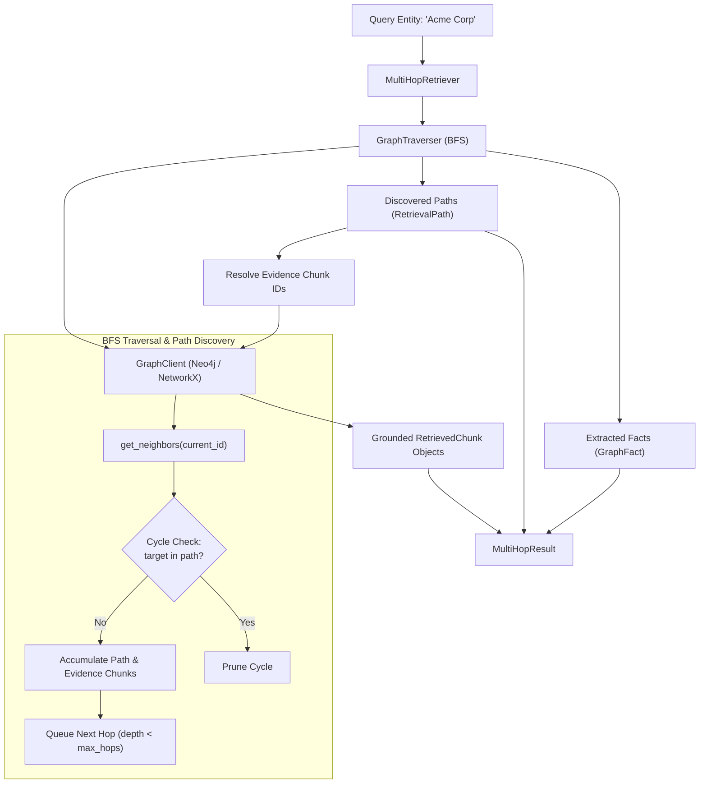

# Lesson 08: Graph Traversal & Multi-Hop Path Retrieval

This document details the design, algorithmic formulation, architecture, and verification of the knowledge graph traversal and multi-hop path retrieval subsystem implemented in **Lesson 8** of GraphRAGX.

---

## 1. Overview & Objectives

While dense vector retrieval (Lesson 7) excels at finding semantically similar text passages, it struggles with queries requiring relational reasoning or multiple hops across disjoint documents (e.g., *"What services does Acme Corp depend on, and which authentication protocols do they enforce?"*).

The knowledge graph solves this by linking entities through typed, directed edges grounded in source chunks. In Lesson 8, we build the traversal engine that discovers multi-hop paths and relational facts:

1. **Breadth-First Search (BFS) Traversal**: Implement `GraphTraverser` to systematically explore outgoing relationships up to $k$ hops deep starting from any seed entity.
2. **Cycle Prevention**: Ensure traversal never gets stuck in infinite loops by maintaining visited entity sets per path.
3. **Path Attenuation Scoring**: Assign confidence scores to paths that decay with distance ($1.0$ for direct 1-hop connections, decreasing for deeper hops).
4. **Relational Fact Extraction**: Deconstruct discovered paths into unique, clean $(A) \xrightarrow{\text{REL}} (B)$ triples with confidence ratings.
5. **Grounded Chunk Aggregation**: Accumulate evidence chunk IDs along traversed edges and retrieve full source text via `client.get_chunk()` without needing re-querying.
6. **Unified Multi-Hop Retriever**: Implement `MultiHopRetriever` returning structured `MultiHopResult` models combining seed entity, paths, facts, and grounded chunks.
7. **CLI Utility**: Provide `scripts/traverse_graph.py` for interactive path discovery and ASCII visualization.

---

## 2. Architecture & Data Flow



---

## 3. Implementation Details

### 3.1. BFS Graph Traverser (`app/graph/traversal.py`)

The `GraphTraverser` provides BFS path exploration:
- **Queue State**: A `collections.deque` tracking tuples of:
  `(current_id, current_name, entities_path, relations_path, evidence_chunks)`
- **Cycle Prevention**: Before enqueueing a neighbor, checks:
  `if target_name in entities_path or target_id in entities_path: continue`
- **Path Scoring**: Score attenuates smoothly with path length:
  $$\text{score} = \frac{1.0}{1.0 + 0.25 \times (\text{length} - 1)}$$
  - 1-hop path: score $= 1.00$
  - 2-hop path: score $= 0.80$
  - 3-hop path: score $= 0.67$
- **Relational Facts**: `find_facts()` extracts unique `(source, relation, target)` triples discovered across all traversed paths, deduplicating identical edges.

### 3.2. Multi-Hop Retriever (`app/retrieval/multi_hop_retriever.py`)

The `MultiHopRetriever` coordinates traversal and text retrieval:
1. Calls `traverser.find_paths()` to discover paths up to `max_hops` deep.
2. Calls `traverser.find_facts()` to collect unique relational triples.
3. Gathers all unique `evidence_chunk_ids` along the paths.
4. Uses `client.get_chunk(chunk_id)` to look up full chunk text and metadata, instantiating `RetrievedChunk` models.
5. Returns a unified `MultiHopResult`.

### 3.3. Dual Graph Chunk Fetching (`app/graph/neo4j_client.py`)

Added `get_chunk(chunk_id: str)` to `GraphClient`:
- **NetworkX**: Fast dictionary lookup `self.graph.nodes[chunk_id]`.
- **Neo4j**: Cypher query `MATCH (c:Chunk {id: $id}) RETURN c.id, c.document_id, c.text, ...`.

---

## 4. Verification & Results

### 4.1. Unit & Integration Tests (`tests/test_graph_traversal.py`)

A comprehensive test suite verifies:
- `test_single_hop_path_discovery`: 1-hop path detection with Cypher string output `(Acme Corp)-[:USES]->(Product Nova)`.
- `test_multi_hop_path_discovery`: 2-hop path detection with score attenuation and chunk evidence aggregation.
- `test_three_hop_path_discovery`: 3-hop exploration across 4 linked entities.
- `test_cycle_prevention`: Traversal cleanly terminates without infinite looping even when cycles exist.
- `test_fact_extraction`: Extraction of clean source-relation-target triples.
- `test_retrieve_with_grounded_chunks`: `MultiHopRetriever` returns grounded `RetrievedChunk` instances with actual document text.
- `test_acme_multi_hop_traversal_on_corpus`: End-to-end traversal on the full 20-document enterprise corpus.

### 4.2. CLI Interactive Inspection (`scripts/traverse_graph.py`)

```bash
$ python scripts/traverse_graph.py --entity "Acme Corp" --max-hops 2
```

Sample output:
```
==================================================
 GraphRAGX — Multi-Hop Graph Traversal
==================================================
Seed Entity: Acme Corp
Max Hops   : 2
Paths Found: 10
Facts Found: 30
Evidence   : 9 grounded chunks
==================================================

--- Discovered Multi-Hop Paths ---
[1] (Acme Corp)-[:USES]->(Billing Engine)
    Length: 1 hop(s) | Score: 1.00
    Evidence Chunk IDs: chunk_company_overview_004

[2] (Acme Corp)-[:USES]->(Product Nova)
    Length: 1 hop(s) | Score: 1.00
    Evidence Chunk IDs: chunk_incident_response_003
...

--- Relational Facts ---
  • (Acme Corp) -[:USES]-> (Billing Engine)
  • (Acme Corp) -[:USES]-> (Product Nova)
  • (Acme Corp) -[:DEPENDS_ON]-> (CloudScale Systems)
  • (Product Nova) -[:DEPENDS_ON]-> (Policy Engine)
  • (Product Nova) -[:RELATED_TO]-> (Identity Service)

--- Grounded Evidence Chunks ---
  [chunk_customer_acme_001] (doc: customer_acme)
    "Acme Corp is a multinational retail and logistics enterprise with over $12B in annual revenue. Acme Corp relies on CloudScale Systems to pow..."
```

---

## 5. Summary & Next Steps

Lesson 8 delivers relational multi-hop path and fact retrieval grounded in source text. With both vector retrieval (Lesson 7) and graph traversal (Lesson 8) operational, the system is ready for **Lesson 9: Hybrid Retrieval & Reciprocal Rank Fusion (RRF)** to fuse vector similarity rankings with graph topological scores.
