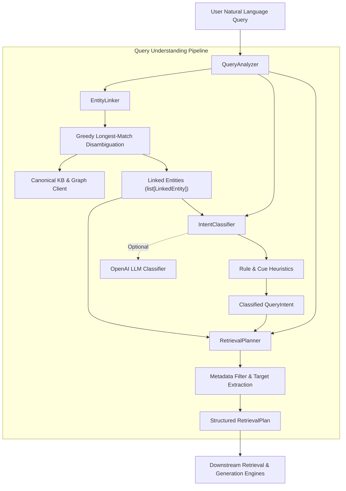

# Lesson 09: Query Understanding, Intent Classification & Entity Linking

This document details the design, algorithmic formulation, architecture, and verification of the query understanding and execution planning subsystem implemented in **Lesson 9** of GraphRAGX.

---

## 1. Overview & Objectives

In production RAG systems, executing raw user questions directly against a single retrieval engine is suboptimal:
- A factual lookup query (*"What is the pricing for Developer Plan?"*) requires high-precision chunk lookup.
- A relationship query (*"How does Acme Corp depend on Identity Service?"*) requires multi-hop graph path discovery.
- A platform-wide inquiry (*"Summarize all products in CloudScale"*) requires holistic community or global aggregation.
- An out-of-domain query (*"What is the capital of France?"*) must be flagged immediately to prevent hallucinations.

In Lesson 9, we implement the **Query Understanding Subsystem** that analyzes natural language input, resolves entity mentions, classifies user intent, and outputs a structured execution plan (`RetrievalPlan`):

1. **Entity Linking & Mention Disambiguation (`EntityLinker`)**:
   - Extract entity surface mentions from natural language queries.
   - Link mentions to canonical entity IDs in the knowledge graph.
   - Employ **greedy longest-match disambiguation** to prioritize specific composite names (e.g. `"Product Nova"` over `"Nova"`, `"OAuth 2.1"` over `"OAuth"`).
   - Support dynamic synchronization from both NetworkX and Neo4j graph databases.
2. **Intent Classification (`IntentClassifier`)**:
   - Classify queries into 7 discrete categories (`DIRECT_FACT`, `ENTITY_LOOKUP`, `RELATIONSHIP`, `MULTI_HOP`, `GLOBAL`, `COMPARISON`, `NO_ANSWER`).
   - Dual-mode architecture: sub-millisecond deterministic regex/token heuristics (100% offline, zero-cost) with optional structured OpenAI LLM completion.
3. **Retrieval Planning (`RetrievalPlanner`)**:
   - Map classified intent and linked entities into a concrete `RetrievalPlan`.
   - Assign appropriate `RetrievalStrategy` (`vector`, `graph`, `hybrid`, `multi_hop`, `global`).
   - Allocate graph traversal hop budgets (`max_hops`), path requirements (`require_paths`), and chunk retrieval limits (`top_k`).
   - Extract structured metadata filters (version numbers, access tiers, department scopes).
4. **Unified Orchestration Facade (`QueryAnalyzer`)**:
   - Coordinate linking, intent classification, and planning into a single method call: `plan = analyzer.analyze(query)`.
5. **Interactive CLI (`scripts/analyze_query.py`)**:
   - Terminal tool to inspect intent, strategy, linked entities, and filters for arbitrary user questions.

---

## 2. Architecture & Data Flow



---

## 3. Intent Taxonomy & Retrieval Strategy Mapping

| Query Intent | Description | Retrieval Strategy | Max Hops | Require Paths | Desired Top K |
| :--- | :--- | :--- | :--- | :--- | :--- |
| `DIRECT_FACT` | Specific factual parameter, metric, or SLA (e.g. price, port, timeout) | `VECTOR` / `HYBRID` | 1 | `False` | 3 |
| `ENTITY_LOOKUP` | Description, definition, or role of an entity (e.g. *"What is Product Nova?"*) | `HYBRID` | 1 | `False` | 5 |
| `RELATIONSHIP` | Direct connection between two entities (*"Does Acme Corp use Nova?"*) | `MULTI_HOP` | 2 | `True` | 5 |
| `MULTI_HOP` | Indirect or chained relational query (*"Impact of Identity Service on Acme"*) | `MULTI_HOP` | 2–3 | `True` | 6 |
| `COMPARISON` | Comparing two products, protocols, or tiers (*"Nova vs Orion"*) | `HYBRID` | 2 | `True` | 8 |
| `GLOBAL` | Dataset-wide holistic summary (*"Summarize all products in CloudScale"*) | `GLOBAL` | 1 | `False` | 10 |
| `NO_ANSWER` | Out-of-domain or unanswerable query (*"Capital of France"*) | `VECTOR` | 1 | `False` | 1 |

---

## 4. Implementation Details

### 4.1. Entity Linker (`app/query/entity_linker.py`)

The `EntityLinker` maps surface strings in natural language queries to canonical graph entities:
- **Registry**: Pre-seeded with curated clusters from `EntityResolver.CANONICAL_CLUSTERS` plus standard platform entities (plans, technologies, tiers).
- **Dynamic Synchronization**: Dynamically inspects `GraphClient` (NetworkX or Neo4j) to register newly ingested custom entities and aliases.
- **Greedy Longest-Match Disambiguation**:
  1. Candidate phrases (names and aliases) are sorted in descending order of character length.
  2. For each candidate phrase, regex boundary checks `(?<![a-zA-Z0-9])` and `(?![a-zA-Z0-9])` match whole terms and prevent partial substring false positives.
  3. Non-overlapping character spans are recorded in `matched_spans`.
  4. If a shorter candidate overlaps with an already accepted longer span (e.g. `"Nova"` inside `"Product Nova"`), it is safely skipped.
  5. Outputs deduplicated `LinkedEntity` instances ordered by position in the query.

### 4.2. Intent Classifier (`app/query/intent_classifier.py`)

The `IntentClassifier` detects user intent using a deterministic heuristic pipeline:
- **Domain Keyword Vocabulary**: Over 60 enterprise keywords (products, services, policies, customers, clusters, protocols).
- **Out-of-Scope Detection**: If no entities are linked and no domain tokens match, immediate classification as `QueryIntent.NO_ANSWER`.
- **Cues & Linguistic Patterns**:
  - Comparison cues: `"compare"`, `"difference between"`, `"versus"`, `"vs"`.
  - Global cues: `"all products"`, `"list all"`, `"summarize all"`, `"overview of all"`, `"entire platform"`.
  - Multi-hop cues: `"indirectly"`, `"chain"`, `"path from"`, `"trace"`, `"downstream"`, `"affect"`, `"blast radius"`.
  - Direct fact cues: `"how much"`, `"what is the price"`, `"rate limit"`, `"port"`, `"sla"`.
  - Relationship cues: `"connected to"`, `"depend on"`, `"does .* use"`, `"integrate with"`.
  - Entity lookup: `"what is <entity>"`, `"tell me about <entity>"`, `"describe <entity>"`.
- **Optional LLM Classification**: When `use_llm=True` and `openai_api_key` is configured, supports OpenAI structured intent completion with graceful heuristic fallback.

### 4.3. Retrieval Planner (`app/query/planner.py`)

The `RetrievalPlanner` synthesizes inputs into a concrete execution plan:
- **Metadata Filters**:
  - Version: Matches `r"\b(?:version\s+|v)?(3\.[12])\b"` -> `{"version": "3.2"}`.
  - Access Tier: Matches contextual patterns like `"confidential tier"` or `"tier: internal"` -> `{"access_tier": "Confidential"}`.
  - Department: Matches contextual phrases like `"in engineering department"`, `"legal team"` -> `{"department": "Engineering"}`.
- **Target Entity Types**: Infers what classes of entities the user is seeking (e.g. `"which customers..."` -> `EntityType.CUSTOMER`).
- **Hop & Top-K Allocation**: Sets traversal depth ($1$ to $3$ hops) and chunk counts based on query breadth.

### 4.4. Query Analyzer Facade (`app/query/analyzer.py`)

Provides a unified high-level entrypoint:
```python
from app.query.analyzer import QueryAnalyzer

analyzer = QueryAnalyzer()
plan = analyzer.analyze("How does Acme Corp depend on Identity Service in version 3.2?")

print(plan.intent)           # QueryIntent.RELATIONSHIP
print(plan.strategy)         # RetrievalStrategy.MULTI_HOP
print(plan.require_paths)    # True
print(plan.filters)          # {'version': '3.2'}
print(plan.seed_entities)    # [Acme Corp, Identity Service]
```

---

## 5. Verification & Test Suite

### 5.1. Automated Unit & Integration Tests (`tests/test_query_understanding.py`)

The test suite covers 20 dedicated test cases:
- `TestEntityLinker`: Exact canonical matching, alias resolution, greedy longest-match disambiguation, version string handling, empty queries, custom entities, and graph client synchronization.
- `TestIntentClassifier`: All 7 intent types verified across varied phrasing and domain contexts.
- `TestRetrievalPlanner`: Strategy mapping, hop budget allocation, path requirement flags, top-k allocation, and metadata filter extraction.
- `TestQueryAnalyzerIntegration`: End-to-end plan generation and out-of-domain rejection.

### 5.2. Test Execution Results

```bash
$ .venv/bin/pytest tests/test_query_understanding.py -v
============================== 20 passed in 0.91s ==============================

$ .venv/bin/pytest tests/ -v
============================== 82 passed in 1.06s ==============================
```

All 82 tests in the GraphRAGX project pass with zero regressions.

---

## 6. CLI Usage & Verification Examples

### Example 1: Relationship Query
```bash
$ python scripts/analyze_query.py --query "How does Acme Corp depend on Identity Service?"

=======================================================
 GraphRAGX — Query Understanding & Retrieval Plan
=======================================================
 Query:             How does Acme Corp depend on Identity Service?
 Classified Intent: RELATIONSHIP
 Strategy:          multi_hop
 Max Graph Hops:    2
 Require Paths:     True
 Desired Top K:     5

 Target Entity Types:
   • SERVICE

 Linked Entities (2):
   1. Mention:     'Acme Corp'
      Canonical:   Acme Corp (entity:customer:acme_corp)
      Type:        CUSTOMER
      Confidence:  1.00
   2. Mention:     'Identity Service'
      Canonical:   Identity Service (entity:service:identity_service)
      Type:        SERVICE
      Confidence:  1.00
=======================================================
```

### Example 2: Entity Comparison
```bash
$ python scripts/analyze_query.py --query "Compare Product Nova and Product Orion"

=======================================================
 GraphRAGX — Query Understanding & Retrieval Plan
=======================================================
 Query:             Compare Product Nova and Product Orion
 Classified Intent: COMPARISON
 Strategy:          hybrid
 Max Graph Hops:    2
 Require Paths:     True
 Desired Top K:     8

 Target Entity Types:
   • PRODUCT

 Linked Entities (2):
   1. Mention:     'Product Nova'
      Canonical:   Product Nova (entity:product:nova)
      Type:        PRODUCT
      Confidence:  1.00
   2. Mention:     'Product Orion'
      Canonical:   Product Orion (entity:product:orion)
      Type:        PRODUCT
      Confidence:  1.00
=======================================================
```

### Example 3: Global Platform Overview
```bash
$ python scripts/analyze_query.py --query "Give me an overview of all platform products"

=======================================================
 GraphRAGX — Query Understanding & Retrieval Plan
=======================================================
 Query:             Give me an overview of all platform products
 Classified Intent: GLOBAL
 Strategy:          global
 Max Graph Hops:    1
 Require Paths:     False
 Desired Top K:     10

 Target Entity Types:
   • PRODUCT

 Linked Entities (0):
   (No specific entities detected in query)
=======================================================
```

### Example 4: Direct Fact Lookup
```bash
$ python scripts/analyze_query.py --query "What is the pricing for Developer Plan?"

=======================================================
 GraphRAGX — Query Understanding & Retrieval Plan
=======================================================
 Query:             What is the pricing for Developer Plan?
 Classified Intent: DIRECT_FACT
 Strategy:          hybrid
 Max Graph Hops:    1
 Require Paths:     False
 Desired Top K:     3

 Target Entity Types:
   • PLAN

 Linked Entities (1):
   1. Mention:     'Developer Plan'
      Canonical:   Developer Plan (entity:plan:developer)
      Type:        PLAN
      Confidence:  1.00
=======================================================
```

### Example 5: Out-of-Domain Guardrail
```bash
$ python scripts/analyze_query.py --query "What is the capital of France?"

=======================================================
 GraphRAGX — Query Understanding & Retrieval Plan
=======================================================
 Query:             What is the capital of France?
 Classified Intent: NO_ANSWER
 Strategy:          vector
 Max Graph Hops:    1
 Require Paths:     False
 Desired Top K:     1

 Linked Entities (0):
   (No specific entities detected in query)
=======================================================
```
